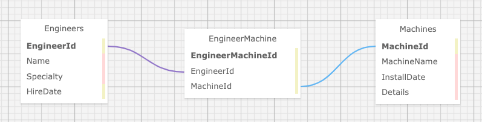

# ➰  ⚙️ 🧵 🥽  **Dr. Sillystringz's Factory**  🧶 🦺  🛠️ ➿   

#### _a C# MVC many-to-many app to enable a factory manager to add a list of engineers, a list of machines, and specify which engineers are licensed to repair which machines._

#### by John Whitten**

#### March 24, 2022

## Table of Contents

1. [Technologies Used](#technologies)
2. [Description](#description)
3. [Setup/Installation Requirements](#setup)
4. [Known Bugs](#bugs)
5. [License](#license)
6. [Contact Information](#contact)

## Technologies Used <a id="technologies"></a>

- C#
- .NET 5.0
- REPL
- MySQL
- Razor
- ASP.NET Core MVC
- Microsoft.EntityFrameworkCore 5.0.0
- Microsoft.EntityFrameworkCore.Design 5.0.0
- Microsoft.NET.Sdk.Web
- Microsoft.NET.Test.Sdk 15.0.0
- MSTest.TestAdapter 1.3.2
- MSTest.TestFramework 1.3.2
- Pomelo.EntityFrameworkCore.MySql 5.0.0-alpha.2

## Description <a id="description"></a>

A many-to-many app to enable a factory manager to keep track of their hired engineers, installed machines, and specify which engineers are licensed to repair which machines.

### Dr. Sillystringz's Factory
_You've been contracted by the factory of the famous Dr. Sillystringz to build an application to keep track of their machine repairs. You are to build an MVC web application to manage their engineers, and the machines they are licensed to fix. The factory manager should be able to add a list of engineers, a list of machines, and specify which engineers are licensed to repair which machines. There should be a many-to-many relationship between Engineers and Machines. An engineer can be licensed to repair (belong to) many machines (such as the Dreamweaver, the Bubblewrappinator, and the Laughbox) and a machine can have many engineers licensed to repair it._

### User Stories
- As the factory manager, I need to be able to see a list of all engineers, and I need to be able to see a list of all machines.
- As the factory manager, I need to be able to select a engineer, see their details, and see a list of all machines that engineer is licensed to repair. I also need to be able to select a machine, see its details, and see a list of all engineers licensed to repair it.
- As the factory manager, I need to add new engineers to our system when they are hired. I also need to add new machines to our system when they are installed.
- As the factory manager, I should be able to add new machines even if no engineers are employed. I should also be able to add new engineers even if no machines are installed
- As the factory manager, I need to be able to add or remove machines that a specific engineer is licensed to repair. I also need to be able to modify this relationship from the other side, and add or remove engineers from a specific machine.
- I should be able to navigate to a splash page that lists all engineers and machines. Users should be able to click on an individual engineer or machine to see all the engineers/machines that belong to it.

### Schema



## Project Setup/Installation Instructions <a id="setup"></a>

### Install C#, .NET, MySQL Community Server and MySQL Workbench

- Open the terminal on your local machine
- If [C#](https://docs.microsoft.com/en-us/dotnet/csharp/) and [.NET](https://docs.microsoft.com/en-us/dotnet/) are not installed on your local device, follow the instructions here [here](https://www.learnhowtoprogram.com/c-and-net-part-time/getting-started-with-c/installing-c-and-net).
- If [MySQL Community Server](https://dev.mysql.com/downloads/mysql/) and [MySQL Workbench](https://www.mysql.com/products/workbench/) are not installed on your local device, follow the instructions [here](https://www.learnhowtoprogram.com/c-and-net-part-time/getting-started-with-c/installing-and-configuring-mysql).
- If [dotnet-ef](https://docs.microsoft.com/en-us/ef/core/cli/dotnet) is not installed on your local device, install it globally with the terminal command ```dotnet tool install --global dotnet-ef --version 5.0.2```.

### Clone the project

- Open the terminal on your local computer.
- Navigate to the parent directory of your preference.
- Clone this project using `$ git clone https://github.com/johnwhittenstudio/DrSillystringzsFactory.Solution`


### Scaffold and connect the database

- Launch the MySQL server with the command `mysql -uroot -p[YOUR-PASSWORD-HERE]`
- Navigate to the directory: `$ cd DrSillystringzsFactory.Solution`
- Open in Vs code: `$ code .`
- Navigate to the project directory Factory: `$ cd Factory` and type the following command in the terminal `$ touch appsettings.json`
- In the appsettings.json file enter the following code:

```
{
    "ConnectionStrings": {
        "DefaultConnection": "Server=localhost;Port=3306;database=john_whitten;uid=root;pwd=[YOUR-PASSWORD-HERE];"
    }
}
```
- Recreate project environment and install required dependencies with terminal command `$ dotnet restore`
- Build the program with the command `$ dotnet build`
- Scaffold the database with the command ```$ dotnet ef database update```

### Run the project
- Run the program with the command `$ dotnet run`

## Known Bugs <a id="bugs"></a>

- _None._

## License <a id="license"></a>

[MIT License](https://opensource.org/licenses/MIT) © 2022 _John Whitten_

## Contact <a id="contact"></a>

John Whitten: [johnwhitten.studio@gmail.com](mailto:johnwhitten.studio@gmail.com)
